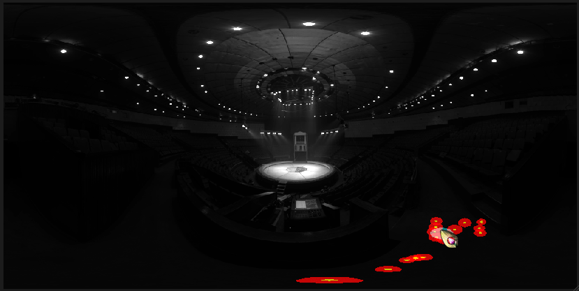
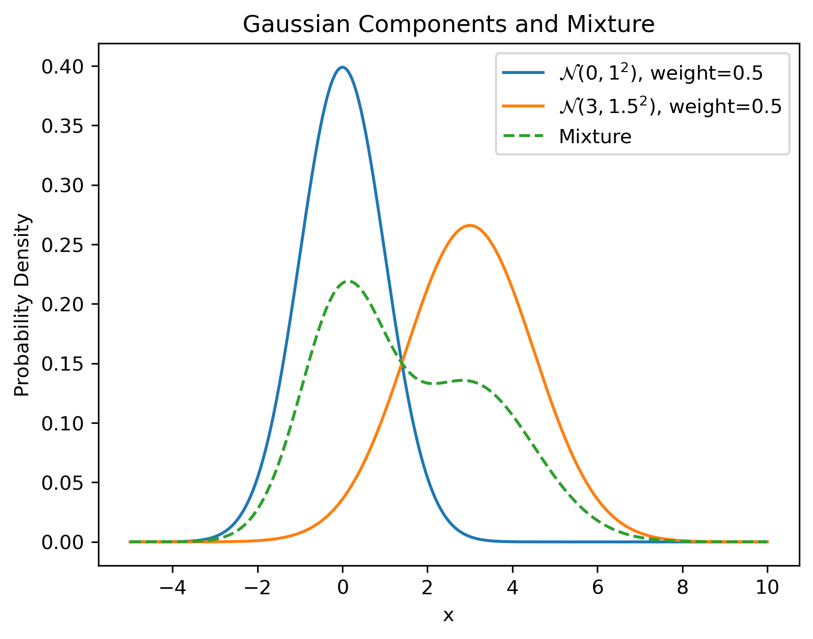
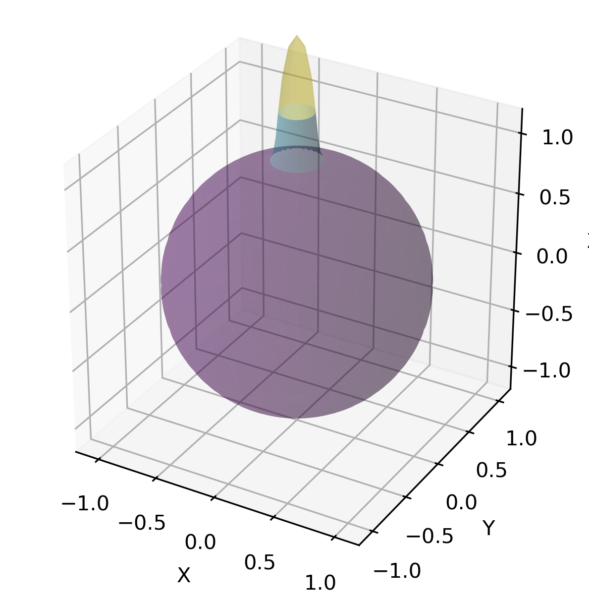
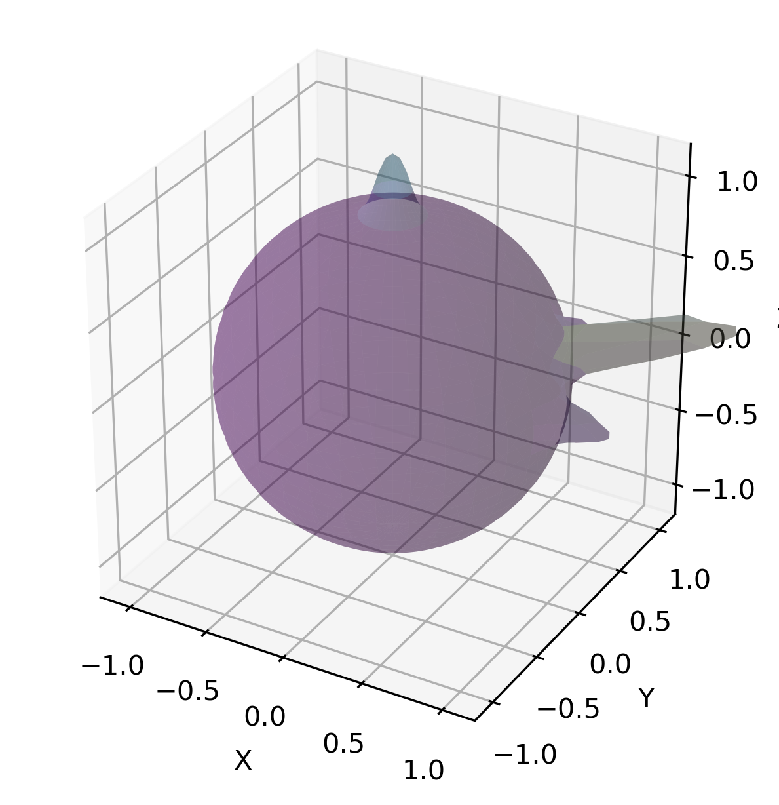
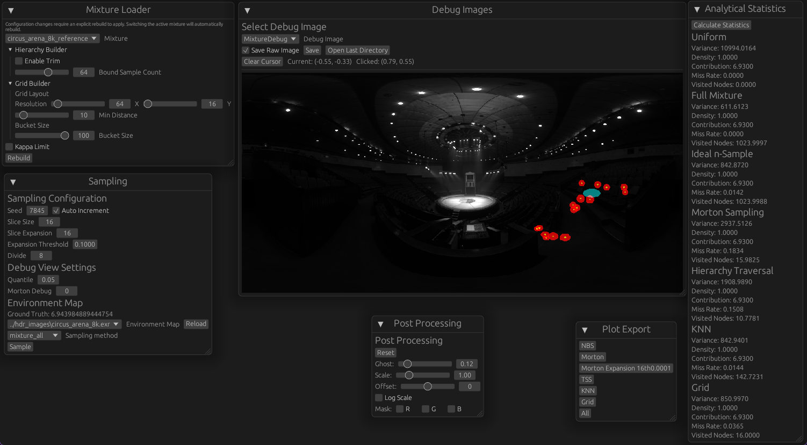
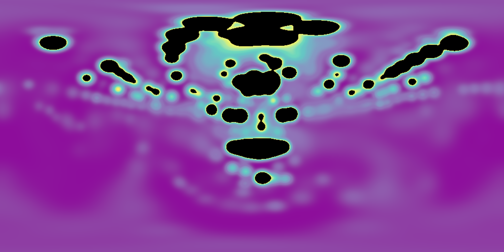
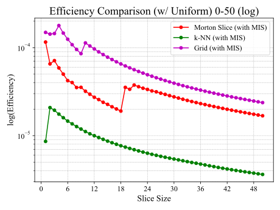

# Partial Estimator for Sampling Large VMF Mixture Models

A GPU-accelerated framework for evaluating component selection strategies in large von Mises-Fisher mixture models, developed as part of my Master's thesis.



*Realtime visualization of Morton slice selection. The red ellipses show the selected VMF components updating as the cursor moves across the environment map.*

## Overview


When simulating realistic lighting in path tracers, renderers use probability models to estimate directions of important lights.
A common way is to use the Bidirectional reflectance distribution function (BRDF), which describes the throughput between two directions across a surface point.
This is called **BRDF sampling**, and it prioritizes directions based on surface properties.
However, BRDF sampling does not account for scene lighting, leading to inefficient sampling when light sources are not aligned with the BRDF lobe.
To address this, **path guiding** techniques learn a model of the incident radiance at each surface point and use it to guide light sampling.
Precomputation is notoriously difficult due to indirect lighting, requiring effectively solving the very rendering problem being approximated.
Instead, online learning methods incrementally build the model during rendering.

A popular choice to represent the incident radiance distribution is a mixture model, such as a von Mises-Fisher (VMF) mixture.
Mixture models combine multiple simpler distributions (components) to approximate complex distributions.
A single VMF distribution is akin to a Gaussian on the sphere, defined by a mean direction and concentration parameter.

<details>
<summary><b>Understanding Mixture Models</b></summary>

| Concept | Visualization |
|---------|---------------|
| **1D Analogy:** Two Gaussian distributions combine into a mixture. Each component contributes proportionally to its weight. |  |
| **On the sphere:** A single VMF distribution. Like a Gaussian, but defined on the unit sphere with a mean direction and concentration parameter κ. |  |
| **Complex mixture:** Multiple VMF components combine to model complex incident radiance distributions. The challenge is evaluating this efficiently. |  |

</details>


Sampling from a mixture model involves calculating the sum of all component PDFs to evaluate the overall PDF at a sample point:

$$p_f(x) = \sum_{i=1}^{N} w_i \cdot p_i(x)$$

With thousands of components, this O(N) summation dominates render time and is not feasible for real-time rendering on the GPU.
Using small mixture models with just a few components is possible, but they struggle to capture complex lighting distributions accurately.

Ignoring some components when evaluating the PDF leads to incorrect probabilities and causes the final image to drift away from the correct result, a phenomenon known as bias.

The ideal is a learning and sampling method that can efficiently handle large mixture models without incurring bias or excessive computational cost.

### The Partial Estimator
This thesis introduces a **partial estimator** that evaluates only a subset of components while remaining unbiased.
In order for this estimator to outperform uninformed sampling, the subset must capture the most relevant components for each direction.

## Technical Implementation
This repository contains a Vulkan-based test framework that implements and benchmarks several strategies for selecting high-quality subsets of components from large VMF mixture models.

It uses pre-fitted mixture models (simulating an online learning scenario) and allows for fast interactive prototyping with GPU accelerated simulations of millions of samples per second.

The repository structure is as follows:
```
framework/
│
├── crates/astrayn/
│   └── Host-only codebase, managing Vulkan and application logic
│       └── src/thesis/ CPU-side thesis code, including mixture loading
│
├── shader/builder/
│   └── spirv-builder from rust-gpu, takes care of compiling shaders to SPIR-V
│
└── shader/shader/
    └── Shared codebase compiled to both SPIR-V (for GPU) and native
        └── Contains a large portion of the thesis code, including the mixture
            model and selection strategies
```


### The Foundation

The foundational codebase is housed in [crates/astrayn/src](crates/astrayn/src), encompassing all core modules except the dedicated `thesis` directory.

This framework started as a learning project to understand GPU programming. 
It implements a minimal Vulkan context with device selection, validation layers, swapchain management, and multi-buffered rendering.
The architecture supports interactive workloads and was built as the foundation for future game development, which so far has not materialized.

### Unified Data Structures

To facilitate code sharing between CPU and GPU, the framework uses unified data structures, using [rust-gpu](https://github.com/rust-gpu/rust-gpu) to compile Rust code to SPIR-V.
Due to limitations with the state of rust-gpu, some things are rather hacky, but the overall experience has been positive.

#### Common Types

##### VMF Mixture Model
The VMF mixture model and distribution types [Mixture](shader/shader/src/thesis/mixture.rs#L83) and [VMFDistribution](shader/shader/src/thesis/vmf_distribution.rs#L26) are defined in the `shader` crate, allowing both CPU and GPU code to use them directly without serialization or translation.

They house the usual methods required for working with VMF distributions, including PDF evaluation and sampling.
Acceleration structures are also baked into the `Mixture` struct for convenience.
A common pattern is the use of *indirection* arrays to allow rearranging components without moving data around in memory, like the [zindices_index](shader/shader/src/thesis/mixture.rs#L103), or the [hierarchy_index](shader/shader/src/thesis/mixture.rs#L109) for tree nodes.
These allow different selection strategies to use their own ordering without duplicating data.
In a real application, one would order the components once during setup to optimize for a specific strategy.

##### Mixture Extension Methods
The [mixture_ext.rs](shader/shader/src/thesis/mixture_ext.rs) module contains extension methods that were not originally designed to be GPU-compatible and belong in the domain of application logic rather than the mathematical model.
This includes [closed form solutions](shader/shader/src/thesis/mixture_ext.rs#L21-L162) for benchmarking and statistics, as well as constant memory [tree traversal algorithms](shader/shader/src/thesis/mixture_ext.rs#L596-L629) for tree-based selection strategies.
With the [advance_knn_search](shader/shader/src/thesis/mixture_ext.rs#L164) function as a notable example of a highly stateful traversal stackless algorithm for tree searching.

##### Tree Structures
All tree structures use the same [TreeNode](shader/shader/src/thesis/mixture_tree.rs#L12) type and a common pattern to store nodes in a flat array and use carefully designed indices to navigate the tree without recursion.

The actual tree struct can be described as just a weight, two child nodes and a bounding VMF distribution, with the following layout:
```rust
pub struct TreeNode {
	vmf: VMFDistribution,
	upper_bound_scaling: f32,
	weight: f32,
	left_child: Option<Box<TreeNode>>,
	right_child: Option<Box<TreeNode>>,
}
```
The additional fields, which are present in the GPU representation, are what allow stackless operations and efficient traversal.
The approach is inspired by a similar design I figured out as part of my Bachelor's thesis on GPU path tracing with lightcuts.


##### Grid Layout
The [GridLayout](shader/shader/src/thesis/vmf_grid.rs#L14) uses a precomputed spherical grid discretization for fast lookups of n-best components.
It allows exploring a selection strategy based on limited precomputation and caching.
Apart from the conversion between spherical coordinates and a 2D grid, it's basically just a 2D array with some adaptive cell collapse near the poles to avoid tiny cells.

##### Mathematical Utilities
The majority of the algorithms also use functions from the [math.rs](shader/shader/src/thesis/math.rs) module, which provides common mathematical utilities like spherical coordinates and angle conversions.

## Interactive Evaluation and Visualization
The framework facilitates interactive evaluation and visualization of the different selection strategies.
The general workflow is as follows:

1. Load a pre-fitted VMF mixture model and an HDR environment map.
2. The framework precomputes any necessary acceleration structures and uploads these to the GPU.
3. The user can then choose between multiple functionalities using [egui](https://github.com/emilk/egui):
	- **Simulate** millions of samples using the selected strategy, then display statistics like variance and convergence rate.
	- **Visualize** the same statistics directly on the environment map, showing which areas are well-covered by the selected components and which are not.
	- **Compare** closed form solutions with the sampled results to verify correctness.



*The egui-based interface: mixture loader (left), sampling controls, debug visualization options, and per-strategy statistics with variance and convergence metrics (right).*


### Building acceleration structures
Since building the acceleration structures was not the focus of this work, the framework uses simple CPU implementations for building.
Performance was only considered to the extent that building times were reasonable for iterating during development.
The builders reside in the CPU-side `thesis` module and are scattered across multiple files as the various strategies were developed.

* The Morton ordering for spatial indexing is populated during mixture loading.
The [MixtureLoader](crates/astrayn/src/thesis/mixture_loader.rs#L220) computes Morton z-indices from component directions in [add_component](shader/shader/src/thesis/mixture.rs#L140), then sorts them in [finalize](shader/shader/src/thesis/mixture.rs#L147).
* The [VMFHierarchyBuilder](crates/astrayn/src/thesis/vmf_hierachy_builder.rs#L160) builds the tree structure using a randomized [bottom-up approach](crates/astrayn/src/thesis/vmf_hierachy_builder.rs#L232), brute-force searching for the [best merges](crates/astrayn/src/thesis/vmf_hierachy_builder.rs#L311-L330) at each step, using [rayon](https://github.com/rayon-rs/rayon).
Additional strategies were considered, but this was sufficient for prototyping.
It combines the precomputation of both the tree search and the upper bounds used for k-nearest neighbor selection.
* The [VMFGridBuilder](crates/astrayn/src/thesis/vmf_grid_builder.rs#L12) precomputes the n-best components for each cell in a spherical grid by brute-force evaluating all components at the cell center directions, also using [rayon](https://github.com/rayon-rs/rayon).


### Shader Entry Points and Sampling Loop

The GPU shaders are organized into three categories: sampling strategies, visualization, and post-processing.
All entry points reside in the [entrypoints](shader/shader/src/thesis/entrypoints) directory.

#### Sampling Strategy Entry Points

Six compute shaders implement the sampling strategies benchmarked in this work.
Each entry point follows the same interface, differing only in how they select the component subset.
They are defined in [sample_shader.rs](shader/shader/src/thesis/entrypoints/sample_shader.rs):

| Entry Point | Strategy | Description |
|-------------|----------|-------------|
| [mixture_all](shader/shader/src/thesis/entrypoints/sample_shader.rs#L120) | Full | Evaluates the complete mixture PDF. Baseline for correctness. |
| [mixture_morton](shader/shader/src/thesis/entrypoints/sample_shader.rs#L132) | Morton Slice | Selects components near the sample along a Morton curve. |
| [mixture_knn](shader/shader/src/thesis/entrypoints/sample_shader.rs#L144) | k-NN | Uses tree upper bounds to find the k components with highest PDF. |
| [mixture_tree_random_full](shader/shader/src/thesis/entrypoints/sample_shader.rs#L156) | Tree Random | Random child selection at each tree level. |
| [mixture_tree_towards_pdf_full](shader/shader/src/thesis/entrypoints/sample_shader.rs#L168) | Tree Deterministic | Picks the child with higher PDF at each level. |
| [mixture_tree_weighted_random_full](shader/shader/src/thesis/entrypoints/sample_shader.rs#L180) | Tree Stochastic | Random child selection weighted by relative PDF. |

The tree traversal strategies use [TowardsPdfTraversal](shader/shader/src/thesis/mixture.rs#L569), [RandomTraversal](shader/shader/src/thesis/mixture.rs#L541), and [WeightedRandomTraversal](shader/shader/src/thesis/mixture.rs#L603) respectively.
k-NN selection is implemented via [advance_knn_search](shader/shader/src/thesis/mixture_ext.rs#L164), a stackless tree traversal with pruning based on upper bounds.

#### The Sampling Loop

All strategies share a common sampling loop implemented in [sample_internal](shader/shader/src/thesis/entrypoints/sample_shader.rs#L192).
Each GPU thread:

1. [Draws a sample](shader/shader/src/thesis/entrypoints/sample_shader.rs#L220) from the full mixture via [sample](shader/shader/src/thesis/mixture.rs#L374), which returns both the [direction](shader/shader/src/thesis/mixture.rs#L385) and the *origin* component index.
2. Selects a component subset using the chosen strategy.
3. Computes the partial PDF $p_p(x)$ by summing over the subset.
4. [Checks](shader/shader/src/thesis/entrypoints/sample_shader.rs#L229) if the origin is in the subset. If not, the sample [contributes zero](shader/shader/src/thesis/entrypoints/sample_shader.rs#L236) (partial estimator).
5. [Accumulates](shader/shader/src/thesis/entrypoints/sample_shader.rs#L240) the [estimate](shader/shader/src/thesis/mixture_ext.rs#L286) $f(x) / p_p(x)$ and [variance](shader/shader/src/thesis/mixture_ext.rs#L299) across invocations.

The per-thread state is stored in [PerThreadState](shader/shader/src/thesis/entrypoints/sample_shader.rs#L64), which tracks the running estimate, variance sum, miss count, and RNG seed across dispatches.

#### Visualization Entry Points

Nine compute shaders in [debug_shader.rs](shader/shader/src/thesis/entrypoints/debug_shader.rs) render statistics onto an equirectangular projection of the environment map:

| Entry Point | Purpose |
|-------------|---------|
| [tint_pdf](shader/shader/src/thesis/entrypoints/debug_shader.rs#L71) | Visualizes Morton slice PDF at each pixel. |
| [tint_tree_pdf](shader/shader/src/thesis/entrypoints/debug_shader.rs#L103) | Compares tree slice PDF (red) vs Morton slice PDF (green). |
| [draw_mixtures](shader/shader/src/thesis/entrypoints/debug_shader.rs#L152) | Draws component ellipses within the selected slice at a given quantile. |
| [draw_rmse](shader/shader/src/thesis/entrypoints/debug_shader.rs#L232) | RMSE and miss rate for Morton selection. |
| [draw_stats_hierarchy](shader/shader/src/thesis/entrypoints/debug_shader.rs#L272) | RMSE and miss rate for tree selection. |
| [draw_stats_knn](shader/shader/src/thesis/entrypoints/debug_shader.rs#L302) | RMSE, miss rate, and visited node ratio for k-NN selection. |
| [draw_stats_grid](shader/shader/src/thesis/entrypoints/debug_shader.rs#L337) | RMSE and miss rate for grid-based precomputation. |
| [draw_pdf_diff](shader/shader/src/thesis/entrypoints/debug_shader.rs#L378) | Absolute difference between full, Morton, and tree PDFs. |
| [draw_grid_debug](shader/shader/src/thesis/entrypoints/debug_shader.rs#L431) | Shows grid cell boundaries and cached PDF values. |

#### Post-Processing

A single shader [post_process](shader/shader/src/thesis/entrypoints/debug_image_pp.rs#L55) in [debug_image_pp.rs](shader/shader/src/thesis/entrypoints/debug_image_pp.rs) applies:
- Channel masking for isolating individual statistics, since multiple stats are packed into RGBA channels of the output texture.
- Optional log-scale transformation for visualizing large dynamic ranges.
- [Viridis colormap](https://cran.r-project.org/web/packages/viridis/vignettes/intro-to-viridis.html) for perceptually uniform scalar visualization.
- Environment map overlay for spatial context.


### Dependencies

The framework relies on a mix of graphics, math, and utility crates from the Rust ecosystem.

<details>
<summary><b>Core</b></summary>

* [spirv-std](https://crates.io/crates/spirv-std) / [spirv-builder](https://crates.io/crates/spirv-builder): Part of [rust-gpu](https://github.com/rust-gpu/rust-gpu). Compiles Rust to SPIR-V for GPU execution.
* [vulkano](https://crates.io/crates/vulkano): Safe Vulkan bindings. Patched locally to support rust-gpu push constant layouts (see [patch/](patch/)).
* [vulkano-win](https://crates.io/crates/vulkano-win): Vulkano integration with windowing libraries.
* [winit](https://crates.io/crates/winit): Cross-platform window creation and event handling.
* [bevy_ecs](https://crates.io/crates/bevy_ecs): Entity-component-system for application structure and scheduling.
</details>

<details>
<summary><b>Math & Data</b></summary>

* [glam](https://crates.io/crates/glam): Fast vector and matrix math with SIMD support, compatible with rust-gpu.
* [bytemuck](https://crates.io/crates/bytemuck): Safe transmutes between plain data types for GPU buffer uploads.
* [pcg32](https://crates.io/crates/pcg32): Minimal PCG random number generator, works on both CPU and GPU.
* [kahan](https://crates.io/crates/kahan): Kahan summation for numerically stable accumulation of floating-point values.
</details>

<details>
<summary><b>Visualization & UI</b></summary>

* [egui](https://crates.io/crates/egui): Immediate mode GUI for debug overlays and parameter tweaking.
* [egui_plot](https://crates.io/crates/egui_plot): Plotting extension for egui, used for variance and convergence graphs.
* [egui_winit_vulkano](https://crates.io/crates/egui_winit_vulkano): Integrates egui with winit and Vulkano.
* [image](https://crates.io/crates/image): Image loading and manipulation.
* [exr](https://crates.io/crates/exr): OpenEXR support for loading and saving HDR environment maps.
* [rfd](https://crates.io/crates/rfd): Native file dialogs for environment map and mixture selection.
</details>

<details>
<summary><b>Serialization & IO</b></summary>

* [serde](https://crates.io/crates/serde) / [serde_json](https://crates.io/crates/serde_json): Serialization for mixture model files and configuration.
</details>

<details>
<summary><b>Parallelism</b></summary>

* [rayon](https://crates.io/crates/rayon): Data parallelism for CPU-side tree building and preprocessing.
* [stacker](https://crates.io/crates/stacker): Stack growth for deep recursive tree construction without overflow.
</details>

<details>
<summary><b>Diagnostics & Utilities</b></summary>

* [tracing](https://crates.io/crates/tracing) / [tracing-subscriber](https://crates.io/crates/tracing-subscriber): Structured logging and performance instrumentation.
* [miette](https://crates.io/crates/miette): Error reporting with source spans and suggestions.
* [lazy_static](https://crates.io/crates/lazy_static): Lazily initialized statics for global configuration.
* [enum-iterator](https://crates.io/crates/enum-iterator): Iteration over enum variants for UI dropdowns.
</details>

<details>
<summary><b>Testing & Compile-time</b></summary>

* [approx](https://crates.io/crates/approx): Approximate floating-point comparisons in tests.
* [static_assertions](https://crates.io/crates/static_assertions): Compile-time assertions, used to verify push constant sizes fit Vulkan limits.
</details>

### Building

Note the following before attempting to build:

* **vulkano**: This code requires a patched version of vulkano 0.34.0 (based on upstream commit `424753d5`) and will not compile against the upstream crate.
The patches disable push constant struct validation that blocks rust-gpu generated shaders.
See [patch/](patch/) for the patch files.
* **Mixture models**: The fitted VMF mixtures used for evaluation are not included.
The loader expects a JSON array matching the [SerdeVMF](crates/astrayn/src/thesis/mixture_loader.rs#L259) struct format.

## Scientific Background

The fitted mixture has a very high dynamic range, making it impossible to capture in a single image.
The log scale reveals the peaks, while the linear scale shows the tails.
Black regions in the linear plot indicate values clipped by the color map.

| Log Scale | Linear Scale |
|-----------|-------------|
|  |  |

*Density of the fitted VMF mixture model for the [Circus Arena](https://polyhaven.com/a/circus_arena) scene (1024 components).*

### The Partial Estimator

Computing the PDF of a sample from a mixture model requires evaluating every component:

$$p_f(x) = \sum_{i=1}^{N} w_i \cdot p_i(x)$$

With thousands of components, this O(N) summation dominates render time and is not feasible for real-time rendering on the GPU.
Simply evaluating a subset introduces bias. The PDF is wrong, and the estimator no longer converges to the correct value.

The thesis introduces a **partial estimator** that evaluates only a subset of components while remaining unbiased.
When sampling from a mixture, a single component generates each sample (the "origin").
Let $p_p(x)$ be the PDF of only the components in the selected subset. The estimator is:

$$\hat{I}(x) = \begin{cases} \frac{f(x)}{p_p(x)} & \text{if origin} \in \text{subset} \\\\ 0 & \text{otherwise} \end{cases}$$

Notice that computing the estimator only requires $p_p(x)$, not $p_f(x)$.
The expensive O(N) summation over all components is avoided entirely.

The "trick" is returning 0 when the origin component isn't in the subset.
This null sample is unbiased because the probability of the origin being in the subset (the "hit rate") exactly equals $p_p(x) / p_f(x)$.
Taking the expectation, these factors cancel:

$$\mathbb{E}[\hat{I}] = \int \underbrace{\frac{p_p(x)}{p_f(x)}}_{\text{hit rate}} \cdot \frac{f(x)}{p_p(x)} \, dx =  f(x)$$

The variance depends on how well the subset captures the relevant components.
Poor selections lead to more null samples and higher variance, though the result stays unbiased.
This is why component selection matters, and why the thesis investigates several strategies for it.

**Important constraint:** The selection process may depend on the sample direction $x$, but it must not depend on which component generated that sample.
If the selection were conditioned on the origin component (e.g., always including it in the subset), the cancellation in the expectation would break and the estimator would become biased.
Any selection method satisfying this constraint yields an unbiased estimator, including randomized selection strategies where the subset is chosen stochastically.

### Selection Strategies

- **n-Best Selection (NBS)**: A theoretical baseline (oracle) that always selects the optimal subset of $n$ components with the highest PDF contribution.
Used to benchmark how close other strategies come to the ideal variance.
- **Morton Slice Selection**: Sorts components along a space-filling Morton curve, selects nearby components.
Fast O(log N) lookup, but struggles when concentration doesn't correlate with locality.
- **Tree-based Selection**: Builds a VMF hierarchy by merging similar components.
Single-path traversal suffers from "false hotspots".
A merged node may show high density, but if that density comes from tightly concentrated child components, it vanishes once the tree splits and the actual concentrations become visible.
- **k-NN Selection**: Augments the tree with upper bounds to enable pruning.
Mitigates false hotspots by backtracking when expected PDF exceeds actual.
- **Grid-based Precomputation**: Precomputes n-best components for probe directions, caches in a spherical grid.



*Estimator efficiency (higher is better) measures variance reduction per component evaluated. "With MIS" indicates Multiple Importance Sampling, combining the partial estimator with uniform sampling to handle areas where the subset misses relevant components. Since the implementation wasn't optimized for runtime, efficiency uses VMF evaluation count as a cost proxy.*

### Key Findings

The n-best selection baseline shows that a small subset (around 20-30 components across test scenes) is enough to approach full mixture quality. The challenge is finding those components quickly and accurately.

Morton slice selection works when components have high concentration, but fails with diffuse components where locality doesn't predict density.

Tree-based selection suffers from a "reorder restriction", where components locked into subtrees can't be selected alongside components in sibling subtrees. The false hotspot problem compounds this.

k-NN handles complex cases better by using upper bounds to prune, but has a hard traversal cost floor. MIS with uniform sampling helps with edge cases.

### Conclusion

The partial estimator makes sampling large mixture models feasible where full evaluation would be too slow. Edge cases exist, particularly components with large weights and low concentration, but MIS with a uniform distribution handles these well. Each selection strategy has its own strengths. Combining them (e.g., using Morton slices to seed k-NN) could be promising.

### Thesis

[Blog post (with full PDF)](https://chrisliebaer.de/blog/master-thesis/)
